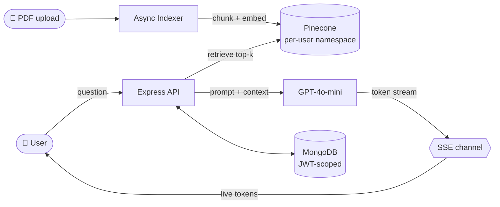

<h1 align="center">DocuMind</h1>

<p align="center">
  <b>AI-powered document Q&A SaaS — upload a PDF, ask questions, get answers with source citations using RAG.</b><br/>
  Multi-tenant · token-streamed · production-deployed.
</p>

<p align="center">
  <a href="https://docu-mind-neon.vercel.app"></a>
  <a href="https://github.com/HAONANTAO/DocuMind"></a>
  
  
  
</p>

<p align="center">
  
</p>

---

## Why this project

LLMs can't read your private documents — they only know what's in their training data. DocuMind closes that gap with a full RAG pipeline: index any PDF into a vector database, retrieve the most relevant passages at query time, and feed them into `gpt-4o-mini` under strict grounding instructions. The result is document Q&A that is fast, accurate, and traceable to the source.

It is built end-to-end as a multi-tenant SaaS — auth, plan limits, async indexing, streaming, security hardening, and per-user data isolation — not a notebook demo.

---

## Engineering Highlights

- **End-to-end RAG pipeline** — PDF parse → recursive chunk (1k / 200 overlap) → OpenAI embeddings → Pinecone retrieve → grounded prompt → token stream.
- **Crash-safe SSE streaming** — sub-second time-to-first-token; mid-stream LLM errors are pushed as terminal frames so the client never hangs.
- **Async indexing** — upload returns instantly with `processing` status; the UI polls `uploading → processing → ready` while embedding runs in the background.
- **Per-tenant isolation** — every user gets a dedicated Pinecone namespace and every Mongo query is scoped by `userId`. Vectors physically can't leak across accounts.
- **Production hardening** — Helmet, strict CORS (refuses to boot without `ALLOWED_ORIGIN`), rate limits on `/auth` & `/chat`, zod validation at every input boundary, bcrypt, no user enumeration.
- **Multi-turn memory + plan quotas** — 6-turn rolling window for follow-up questions; weekly-rolling per-user usage counters surfaced as live bars in the UI.

---

## Architecture



**Indexing — runs once per upload**

```
PDF ──▶ pdf-parse ──▶ RecursiveCharacterTextSplitter ──▶ OpenAI Embeddings ──▶ Pinecone
                       (1,000 chars, 200 overlap)        (text-embedding-3-small)   (namespace: user_<id>,
                                                                                     metadata: documentId,
                                                                                     chunkIndex)
```

**Query — runs on every chat message**

```
Question ──▶ Embed question ──▶ Pinecone top-k=5 ──▶ Prompt(system + chunks + last 6 turns)
                                (namespace: user_<id>,                       │
                                 filter: documentId)                         ▼
                                                            gpt-4o-mini (LangChain stream)
                                                                             │
                                                              ┌──────────────┴──────────────┐
                                                              ▼                             ▼
                                                       SSE → frontend              MongoDB Conversation
                                                       (tokens + sources)          (messages + sources)
```

---

## Streaming under failure — the SSE edge case

Once you've sent SSE headers (`Content-Type: text/event-stream`), `res.headersSent === true`. You can no longer respond with `500` — the HTTP envelope is closed. If the LLM crashes mid-stream and you don't handle it, the client hangs forever.

```mermaid
sequenceDiagram
    autonumber
    actor U as User
    participant API as Express API
    participant P as Pinecone
    participant L as GPT-4o-mini

    U->>API: POST /ask (question + JWT)
    API->>API: verify JWT → userId
    API->>P: vector search (namespace = userId)
    P-->>API: top-k chunks
    API-->>U: 200 OK · SSE headers sent
    API->>L: prompt + retrieved context

    loop token stream
        L-->>API: token
        API-->>U: data: <token>
    end

    rect rgb(60, 30, 30)
    Note over API,L: ⚠️ if LLM crashes mid-stream:<br/>res.headersSent === true → can't send 500.<br/>Push error frame down the open SSE channel<br/>so the frontend never hangs.
    end

    L-->>API: [DONE]
    API-->>U: data: [DONE] · close stream
```



The fix — push the error down the same channel and let the frontend treat it as a terminal frame:

```js
try {
  for await (const token of llmStream) {
    res.write(`data: ${JSON.stringify({ token })}\n\n`);
  }
  res.write(`data: [DONE]\n\n`);
} catch (err) {
  // headers already sent — can't res.status(500).json(...)
  res.write(`data: ${JSON.stringify({ error: err.message })}\n\n`);
} finally {
  res.end();
}
```

---

## Decisions & Tradeoffs

The interesting part of building production RAG isn't picking a stack — it's the parameter choices nobody documents. Each row below is a place I chose `A` over `B` and had a reason.

| Choice | Why this, not the alternative |
| --- | --- |
| **Chunk: 1k chars · 200 overlap** | 500 chars over-fragments multi-sentence answers; 2k dilutes retrieval precision. 200-char overlap stops answers from being split across a chunk boundary. |
| **Embedding: `text-embedding-3-small`** | ~5× cheaper than `-large`; quality delta is negligible on short PDF chunks. Cost matters when ingestion scales with users. |
| **Retrieval: top-5** | k=3 misses multi-paragraph answers; k=10 dilutes signal and burns context window. 5 is the elbow. |
| **Generation: `gpt-4o-mini` @ `temperature=0`** | This is RAG, not creative writing. Users notice nondeterminism — same question should return the same answer. Roughly 30× cheaper than `gpt-4o` and accuracy is bottlenecked by retrieval, not the model. |
| **Memory: 6-message rolling window** | Bounded memory ⇒ bounded token cost per turn. Unbounded history grows linearly and dilutes the system prompt. |
| **Tenancy: Pinecone namespace, not metadata filter** | Namespace isolation is enforced at the index — a buggy filter can leak across tenants; a missing namespace can't. Also faster: Pinecone never scans other users' vectors. |
| **Transport: SSE, not WebSockets** | Chat is one-way streaming. SSE is a single HTTP request with auto-reconnect built in, plays nicely with Express middleware, and avoids running a WebSocket gateway. WS would only pay off for full duplex. |
| **Indexing: async, not blocking the upload response** | Embedding a 50-page PDF takes 5–15s. Holding the HTTP connection open is poor UX (no progress) and brittle (proxy timeouts). Return immediately with `processing`, let the UI poll. |
| **Delete order: MongoDB first, Pinecone second** | If Pinecone fails after Mongo succeeds → *soft orphan* (dangling vectors, no doc — invisible, recoverable on next cleanup pass). Reverse order → *hard orphan* (doc with no vectors — broken UX, user-visible). |

---

## API Reference

Base URL: `https://<your-backend>/api`. All protected routes require `Authorization: Bearer <jwt>`.

### Auth

| Method | Path | Auth | Description |
|---|---|---|---|
| `POST` | `/auth/register` | — | Create account |
| `POST` | `/auth/login` | — | Login, returns JWT |
| `GET`  | `/auth/me` | ✓ | Current user profile |
| `GET`  | `/auth/usage` | ✓ | Plan usage stats |

```jsonc
// POST /auth/login
{ "email": "user@example.com", "password": "yourpassword" }

// → 200 OK
{ "token": "<jwt>", "user": { "_id": "...", "email": "...", "plan": "free" } }
```

### Documents

| Method | Path | Auth | Description |
|---|---|---|---|
| `POST`   | `/documents/upload` | ✓ | Upload PDF (`multipart/form-data`, field `file`, ≤20 MB) |
| `GET`    | `/documents`        | ✓ | List user's documents |
| `DELETE` | `/documents/:id`    | ✓ | Delete document + vectors |

Status lifecycle: `uploading → processing → ready | error`.

### Chat

| Method | Path | Auth | Description |
|---|---|---|---|
| `POST` | `/chat` | ✓ | Ask a question, streams response (SSE) |
| `GET`  | `/chat/:documentId/history` | ✓ | Conversation history |

```jsonc
// POST /chat
{ "documentId": "<id>", "question": "What are the key findings?" }

// → text/event-stream
// raw tokens streamed as generated, then a final JSON event:
{
  "done": true,
  "sources": [
    { "content": "...chunk text...", "metadata": { "documentId": "...", "chunkIndex": 3 } }
  ]
}
```

---

## Security

- **Helmet** — CSP, X-Frame-Options, X-Content-Type-Options, etc.
- **Strict CORS** — production server *refuses to boot* without `ALLOWED_ORIGIN`; no `*` fallback.
- **Rate limiting** — `/auth/*`: 10 attempts / IP / 15 min · `/chat/*`: 30 req / user / minute (keyed by JWT user id).
- **Input validation** — every user-provided body is validated with `zod` before reaching business logic.
- **Password rules** — ≥8 chars with at least one letter and one digit; bcrypt cost 10.
- **No user enumeration** — `/auth/login` returns the same generic error for unknown email vs. wrong password.
- **Per-tenant data isolation** — every MongoDB query is scoped by `userId`; Pinecone uses one namespace per user.

### Known limitations

- **JWT in `localStorage`** — vulnerable to XSS if a dependency is compromised. Mitigated today by strict CSP and DOMPurify-sanitised markdown rendering. Migrating to httpOnly cookie + CSRF token is on the short-term roadmap.
- **No automated test suite yet** — the controls above are reviewed manually. An integration suite (auth, rate-limit, CORS, RAG end-to-end) is the next priority.

---

## Tech Stack

| Layer | Choice |
|---|---|
| Frontend | React 19, React Router v6, Tailwind CSS, Axios |
| Backend | Node.js, Express 5 |
| Database | MongoDB + Mongoose |
| Vector store | Pinecone (1,536-dim, cosine) |
| LLM / embeddings | OpenAI `gpt-4o-mini` + `text-embedding-3-small` |
| RAG framework | LangChain |
| PDF parsing | pdf-parse |
| Auth | JWT + bcryptjs |
| Uploads | Multer (in-memory, 20 MB cap) |
| Hosting | Vercel (frontend), Render (backend) |

---

## Local Development

<details>
<summary>Setup instructions</summary>

### Prerequisites
- Node.js 18+
- MongoDB (Atlas or local)
- Pinecone account with an index named `documind` (1,536 dims, cosine)
- OpenAI API key

### Backend

```bash
cd backend
npm install
```

Create `backend/.env`:

```env
PORT=3001
MONGODB_URI=your_mongodb_connection_string
JWT_SECRET=your_jwt_secret_at_least_32_chars
PINECONE_API_KEY=your_pinecone_api_key
PINECONE_INDEX=documind
OPENAI_API_KEY=your_openai_api_key
ALLOWED_ORIGIN=http://localhost:3000
```

```bash
npm run dev      # nodemon, hot reload
npm start        # production
```

Backend listens on `http://localhost:3001`.

### Frontend

```bash
cd frontend
npm install
cp .env.example .env.local   # then fill REACT_APP_API_URL=http://localhost:3001/api
npm start
```

Frontend at `http://localhost:3000`.

### Environment variables

**Backend**

| Variable | Required | Notes |
|---|---|---|
| `PORT` | — | Default `3001` |
| `MONGODB_URI` | ✓ | |
| `JWT_SECRET` | ✓ | ≥32 chars recommended |
| `PINECONE_API_KEY` | ✓ | |
| `PINECONE_INDEX` | ✓ | Must match the created index name |
| `OPENAI_API_KEY` | ✓ | |
| `NODE_ENV` | — | `production` enforces strict CORS |
| `ALLOWED_ORIGIN` | ✓ (prod) | Comma-separated origins; server refuses to start without it when `NODE_ENV=production` |

**Frontend**

| Variable | Required | Notes |
|---|---|---|
| `REACT_APP_API_URL` | ✓ (prod) | e.g. `https://your-backend.onrender.com/api` |
| `DISABLE_ESLINT_PLUGIN` | — | Disable ESLint during build |

</details>

---

## Project Structure

```
DocuMind/
├── backend/src/
│   ├── index.js                  # Express app, middleware, CORS, rate limits
│   ├── middleware/auth.js        # JWT verification
│   ├── models/                   # User, Document, Conversation (Mongoose)
│   ├── routes/                   # auth, documents, chat
│   └── config/
│       ├── documentProcessor.js  # parse → chunk → embed → upsert
│       ├── retriever.js          # similarity search + prompt assembly
│       └── rag.js                # LangChain chain config
└── frontend/src/
    ├── App.js                    # routes + protected route guard
    ├── context/AuthContext.js    # global auth state
    ├── api/axios.js              # axios with auth interceptor
    └── pages/                    # Login, Documents, Chat, Pricing
```

---

## Roadmap

- [ ] **PDF viewer with highlighted citations** — show the source page inline with the matched passage highlighted, so users verify answers without leaving the app.
- [ ] **Stripe billing for Pro plan** — full upgrade / subscription / webhook flow.
- [ ] **Agent mode** — let the LLM decide whether to retrieve from the document or answer directly, instead of always forcing a RAG lookup.
- [ ] **Team workspaces** — shared document libraries with owner / editor / viewer roles.
- [ ] **More file types** — DOCX, TXT, Markdown, and web URLs in addition to PDF.
- [ ] **httpOnly cookie auth + CSRF token** — replace `localStorage` JWT to harden against XSS.
- [ ] **Automated test suite** — auth, rate-limit, CORS, RAG end-to-end integration tests.

---

## License

MIT

<p align="center">
  <sub>Built by <a href="https://github.com/HAONANTAO">@HAONANTAO</a> · <a href="https://www.aarontao.com/">aarontao.com</a></sub>
</p>
